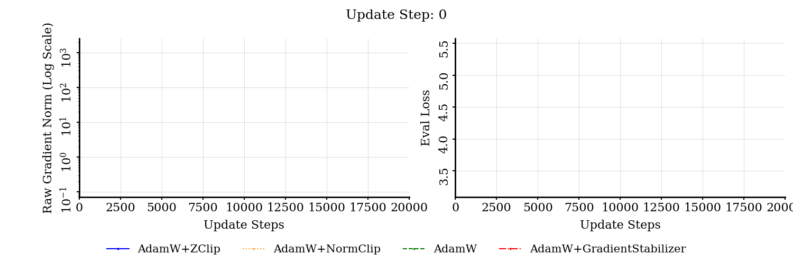

# SPAM
This repo contains the pre-release version of GradientStabilizer, proposed by [GradientStabilizer: Fix the Norm, Not the Gradient](https://arxiv.org/pdf/2502.17055).

We introduce  GradientStabilizer, a lightweight, drop-in gradient transform that preserves the instantaneous gradient direction while replacing the update magnitude with a statistically stabilized estimate derived from running gradient-norm statistics.

<div align="center">
  
</div>

## Abstract

Training instability in modern deep learning systems is frequently triggered by rare but extreme gradient-norm spikes, which can induce oversized parameter updates, corrupt optimizer
state, and lead to slow recovery or divergence. Widely used safeguards such as gradient clipping mitigate these failures but require threshold tuning and indiscriminately truncate large updates. We propose GradientStabilizer, a lightweight, drop-in gradient transform that preserves the instantaneous gradient direction while replacing the update magnitude with a statistically stabilized estimate derived from running gradient-norm statistics. We prove that the resulting stabilized magnitude is uniformly bounded on spike steps, independent of the spike
size, and show how this boundedness controls optimizer state evolution in adaptive methods. Across LLM pre-training (FP16), quantizationaware pre-training (FP4), ImageNet classification,
reinforcement learning, and time-series forecasting, GradientStabilizer consistently improves training stability, widens stable learningrate regions, and reduces divergence relative to clipping-based baselines, even substantially reducing Adam’s sensitivity to weight-decay strength.


# Usage

EMA-based per-parameter gradient magnitude stabilisation for adaptive
optimisers (Adam, AdamW, Lion, etc.). Drop-in wrapper around any
`torch.optim.Optimizer`.

---

## Installation

### Local editable installation

From the repository root:

```bash
python -m pip install -e .
```

### Standard local installation

```bash
python -m pip install .
```

Requirements: `torch >= 1.13`. No other dependencies.

---

## Quickstart

```python
import torch
from GradientStabilizer import GSWrapper

model     = MyModel().cuda()
optimizer = torch.optim.AdamW(model.parameters(), lr=1e-3,
                              betas=(0.9, 0.999), weight_decay=0.01)
optimizer = GSWrapper(optimizer, gamma1=0.6, gamma2=0.999)

for batch in loader:
    optimizer.zero_grad(set_to_none=True)
    loss = loss_fn(model(batch), target)
    loss.backward()
    optimizer.step()
```

That is the entire change relative to a vanilla AdamW loop. LR
schedulers, gradient hooks, and DDP all see the wrapped optimiser as
an ordinary `Optimizer`.

---

## Mixed precision (AMP)

`GSWrapper` is compatible with `torch.amp.GradScaler` without
modification. The standard pattern:

```python
import torch
from torch.amp import autocast, GradScaler
from GradientStabilizer import GSWrapper

scaler    = GradScaler("cuda")
optimizer = GSWrapper(
    torch.optim.AdamW(model.parameters(), lr=1e-3),
    gamma1=0.6, gamma2=0.999,
)

for batch in loader:
    optimizer.zero_grad(set_to_none=True)
    with autocast(device_type="cuda", dtype=torch.float16):
        loss = loss_fn(model(batch), target)
    scaler.scale(loss).backward()
    scaler.step(optimizer)
    scaler.update()
```

Key behaviours:

- `scaler.step(optimizer)` unscales gradients *before* calling
  `optimizer.step()`, so the wrapper's EMAs always see true,
  unscale-corrected gradient norms.
- When `GradScaler` detects `inf`/`nan` in gradients, it skips
  `optimizer.step()` entirely. The wrapper's EMA counter does not
  advance in that case, so bias correction stays consistent with the
  number of real updates.
- Gradient norms are computed in fp32 and the EMAs are stored in fp32
  regardless of `g.dtype`, so fp16 / bf16 gradients are handled
  correctly.

### Manual unscale + clipping

The unscale–clip–step pattern also works:

```python
scaler.scale(loss).backward()
scaler.unscale_(optimizer)
torch.nn.utils.clip_grad_norm_(model.parameters(), 1.0)
scaler.step(optimizer)
scaler.update()
```

Clipping operates on true-magnitude gradients, the wrapper then
normalises the clipped signal, then AdamW updates.

### bf16 without `GradScaler`

For pure bf16 training without a scaler, the wrapper's internal
finite-norm check (`_scale_param`) is your only defence against a
single bad parameter. If a NaN gradient appears, the wrapper skips
that parameter's update but leaves `p.grad` untouched, which means a
NaN could still reach the base optimiser. If this matters for your
workload, add `g.zero_()` before the early return in `_scale_param`.

---

## Distributed training

### DDP

No changes required. Each rank computes local gradients, DDP
all-reduces them, then each rank's wrapper sees the synchronised
gradient and applies an identical rescaling. The EMAs stay in sync
across ranks because they are deterministic functions of the
synchronised gradient norm.

### FSDP

Works with FULL_SHARD and SHARD_GRAD_OP. Each rank holds only its
gradient shard, so the wrapper's per-parameter EMAs track shard-local
norms. This is the intended behaviour — the rescaling is local to the
shard and produces consistent updates after the all-gather.

### Skip diagnostics across ranks

The wrapper maintains a `skipped` counter per parameter for diagnostic
purposes (non-finite or zero-norm events). For aggregated visibility
across ranks, sum these in your logging code:

```python
total_skipped = sum(
    st.get("skipped", 0)
    for st in optimizer.scaler.state.values()
)
torch.distributed.all_reduce(
    torch.tensor(total_skipped, device="cuda"),
    op=torch.distributed.ReduceOp.SUM,
)
```

---

## Checkpointing

`state_dict()` and `load_state_dict()` persist both the inner
optimiser state and the wrapper's EMAs, re-keyed from runtime
`id(p)` to positional index so that checkpoints survive a process
restart:

```python
# Save
torch.save({
    "model":     model.state_dict(),
    "optimizer": optimizer.state_dict(),
    "step":      global_step,
}, "ckpt.pt")

# Load
ckpt = torch.load("ckpt.pt", map_location="cpu")
model.load_state_dict(ckpt["model"])
optimizer.load_state_dict(ckpt["optimizer"])
```

Scaler hyperparameters (`gamma1`, `gamma2`, `eps`, `bias_correction`)
are saved alongside the EMAs. If they differ from the current
wrapper's settings on load, a warning is printed; the current
settings are kept (load does not overwrite hyperparameters).

---

## Hyperparameters

| Name              | Default  | Purpose                                                                 |
|-------------------|----------|-------------------------------------------------------------------------|
| `gamma1`          | `0.6`    | EMA coefficient for `E[\|\|g\|\|]`. Smaller → more responsive.          |
| `gamma2`          | `0.999`  | EMA coefficient for `E[\|\|g\|\|²]`. Mirrors Adam's `beta2`.            |
| `eps`             | `1e-12`  | Numerical floor in the divisions and sqrt.                              |
| `bias_correction` | `True`   | Adam-style `1 / (1 - gamma**step)` correction.                          |

Recommended starting points by workload:

- **Vision / discriminative training:** defaults.
- **LLM pre-training:** defaults; consider `gamma1 ∈ [0.6, 0.9]` for
  smoother long-horizon adaptation.
- **Fine-tuning / few-step adaptation:** smaller `gamma2` (e.g.
  `0.99`) so the second-moment EMA converges faster on short runs.


## Combining with gradient accumulation

Standard pattern works:

```python
optimizer.zero_grad(set_to_none=True)
for micro_batch in accumulate(batch, num_micro=4):
    with autocast(device_type="cuda", dtype=torch.float16):
        loss = loss_fn(model(micro_batch), target) / 4
    scaler.scale(loss).backward()
scaler.step(optimizer)   # rescaling happens once, on the accumulated grad
scaler.update()
```

The wrapper sees the *accumulated* gradient, not each micro-batch's
contribution. This is the intended semantics — the EMA tracks the
statistics of the effective gradient used by the optimiser.

---

## API reference

### `GSWrapper(optimizer, **scaler_kwargs)`

Optimiser wrapper. `scaler_kwargs` are forwarded to
`GradientStabilizer`.

Properties / methods forwarded to the inner optimiser:
`param_groups`, `state`, `defaults`, `zero_grad`, `add_param_group`.

Own methods: `step`, `state_dict`, `load_state_dict`.

### `GradientStabilizer(gamma1, gamma2, eps, bias_correction)`

The scaling logic itself. Callable on:

- a `torch.optim.Optimizer` (uses its `param_groups`),
- a list of param-group dicts,
- any iterable of `torch.nn.Parameter`.

Methods: `reset()` (drops all EMAs); `state` (dict, per-parameter
EMAs and counters).

---

## Caveats

- **The fused-AMP scaling path is bypassed.** `GSWrapper` does not
  set `_step_supports_amp_scaling`, so `GradScaler.step` takes the
  standard unscale-then-step path even when the inner optimiser was
  built with `fused=True`. This is correct but loses a small CUDA-kernel
  fusion. Negligible for most training; relevant only if the optimiser
  step is on the critical path.

- **Sparse gradients are not supported.** `_scale_param` returns
  early on `g.is_sparse`. Embedding layers with sparse gradients pass
  through unmodified to the base optimiser.

- **Per-parameter operation.** The wrapper rescales each parameter
  tensor independently. There is no cross-parameter coupling; if you
  need a global-norm-style rescaling, that is a different method.

- **The `skipped` counter is a fallback signal.** Under classic fp16
  AMP, `GradScaler` catches most inf/nan events before the wrapper
  runs, so `skipped` typically stays at zero. A growing `skipped` for
  a specific parameter is a signal that something upstream
  (initialisation, loss scale, data) needs attention.

---

## Citation

@inproceedings{huang2026gradientstabilizer,
  title     = {{GradientStabilizer}: Fix the Norm, Not the Gradient},
  author    = {Huang, Tianjin and Wang, Zhangyang and Hu, Haotian and Zhang, Zhenyu and Jin, Gaojie and Li, Xiang and Shen, Li and Shang, Jiaxing and Chen, Tianlong and Li, Ke and Liu, Lu and Wen, Qingsong and Liu, Shiwei},
  booktitle = {Proceedings of the 43rd International Conference on Machine Learning},
  year      = {2026},
  url       = {https://arxiv.org/abs/2502.17055},
  archivePrefix = {arXiv},
  eprint    = {2502.17055},
  primaryClass = {cs.LG}
}

---

